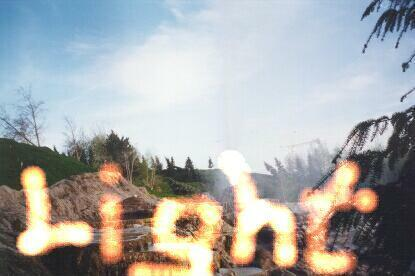



## Light Effects \(Multiple Lights\!\)

### Description

This works just like the other one, but it now supports multiple lights at once and comes in a Drawing-like interface (that's what I used to make that screenshot).

You can also choose the background image, so you can use it to add speciall effects to ANY image you have, using multiple colors at the same time!

Many thanks to Simon Price -- I took the function that extracts the RGBs without errors from one of his submissions!
 
### More Info
 
Just call a the function and the light will be drawn. Simple, heh? Instructions are in the (new) Readme.txt! (I changed some things in it)

I didn't post this as an update to the other one because it fixes ALL side effects/bugs!

             |
---                |---
**Submitted On**   |2000-08-25 22:08:36
**By**             |[Jotaf98](https://github.com/Planet-Source-Code/PSCIndex/blob/master/ByAuthor/jotaf98.md)
**Level**          |Intermediate
**User Rating**    |4.7 (47 globes from 10 users)
**Compatibility**  |VB 3\.0, VB 4\.0 \(16\-bit\), VB 4\.0 \(32\-bit\), VB 5\.0, VB 6\.0
**Category**       |[Graphics](https://github.com/Planet-Source-Code/PSCIndex/blob/master/ByCategory/graphics__1-46.md)
**World**          |[Visual Basic](https://github.com/Planet-Source-Code/PSCIndex/blob/master/ByWorld/visual-basic.md)
**Archive File**   |[CODE\_UPLOAD93168252000\.zip](https://github.com/Planet-Source-Code/jotaf98-light-effects-multiple-lights__1-10982/archive/master.zip)

